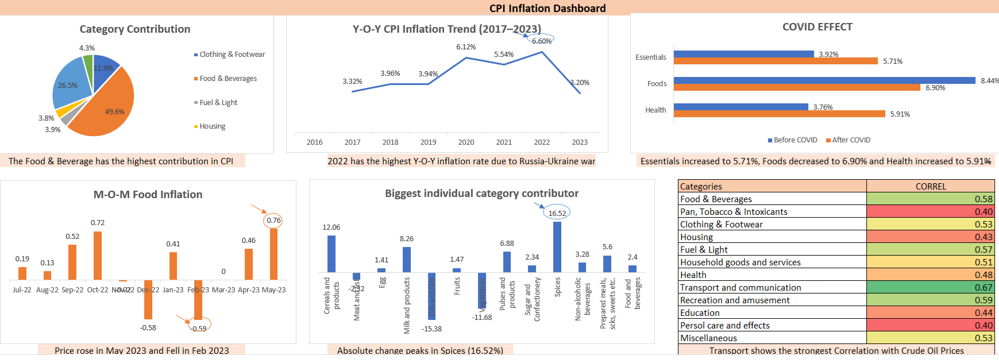

# 📊 CPI Inflation Analysis – India

> 📌 This project analyzes India’s Consumer Price Index (CPI) data using Microsoft Excel to uncover inflation trends, category contributions, and the impact of global and domestic factors.

## 🔍 Overview

This project explores inflation trends in India by analyzing CPI data across multiple years. The analysis focuses on understanding how key categories such as food, energy, and transportation contribute to overall inflation, along with examining both short-term (MoM) and long-term (YoY) changes.

Additionally, the study evaluates the influence of external factors like COVID-19 and global crude oil price fluctuations on inflation patterns.

## 🎯 Objectives

* Analyze CPI trends across multiple years
* Identify category-wise contribution to overall inflation
* Examine volatility in food inflation
* Compare Month-on-Month (MoM) and Year-on-Year (YoY) changes
* Assess the impact of COVID-19 and crude oil prices on inflation

## 🛠 Tools & Techniques

* Microsoft Excel
* Pivot Tables
* Data Cleaning & Transformation
* Data Visualization (Charts & Dashboards)

## 📊 Analysis Performed

*  **Year-on-Year (YoY) Analysis** to track long-term inflation trends
*  **Month-on-Month (MoM) Analysis** to capture short-term fluctuations
*  **Category Contribution Analysis** (Food, Energy, Transport, etc.)
*  **COVID-19 Impact Analysis** on inflation patterns
*  **Crude Oil Price Analysis** and its effect on CPI
*  **Dashboard Creation** for visual insights

## 📈 Key Insights

* Inflation peaked in **2022**, driven by a surge in global oil prices following the Russia–Ukraine conflict
* Rising fuel and transportation costs significantly impacted overall CPI
* Supply chain disruptions and currency depreciation increased import costs
* Food inflation showed the **highest volatility**, with sharp month-on-month fluctuations
* While global factors triggered inflation spikes, **food inflation remained a consistent driver of overall CPI trends**

## 📊 Dashboard Preview

## 📁 Files Included

* `cpi_inflation_analysis.xlsx` – Excel workbook with 10 worksheets covering complete analysis
* Dashboard visuals and analytical charts included within the workbook

## 🚀 Conclusion

This analysis highlights that inflation in India is driven by a combination of global shocks (such as oil price fluctuations) and domestic factors, particularly food price volatility. Understanding these dynamics is essential for economic forecasting and informed policy decision-making.

## Author

**Gunjan Rana**
